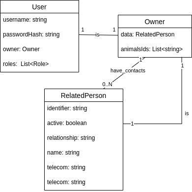

# API REST

Esta API REST funcionará como Gateway para os microsserviços com as funcionalidades do sistema. Neste projeto a API controlará os usuários da aplicação e suas permissões de acesso aos sistemas. 

# Funcionalidades Próprias

- Cadastro de usuário: necessita dos dados do dono.
- Gerência de permissões dos usuários (somente para admins).

# Exposição de microsserviços

- Cadastro de animal
- Cadastro de quadro-clínico

# Como rodar o projeto
Clone o projeto e entre na pasta raiz.

## Utilizando docker
Obs: o Dockerfile disponível roda a aplicação em modo de produção.

Pré-requisitos:
- docker

### Construa a imagem da aplicação(os):
`docker build -t bicho-bao-api .`

### Rode o container
`docker run -d -p 3000:3000 bicho-bao-api`

A aplicação estará rodando em `localhost:3000`.

## Construindo a aplicação locamente

Pré-requisitos:
- Ambiente Node.js LTS (14 ou 16)
- yarn ou npm instalados

Ao clonar o projeto e entrar na pasta raiz:

### Instale as dependências
```
# utilizando o yarn
yarn

# utilizando npm
npm install
```

### (Opcional para modo de desenvolvimento) Construa a aplicação

```
# utilizando yarn
yarn build

# utilizando npm
npm build
```

### Rode a aplicação

- Em modo de desenvolvimento:
```
# utilizando o yarn
yarn start:prod

# utilizando o npm
npm start:prod
```

- Em modo de produção:
```
# utilizando o yarn
yarn start:prod

# utilizando o npm
npm start:prod
```

# Esquema lógico do banco de dados




